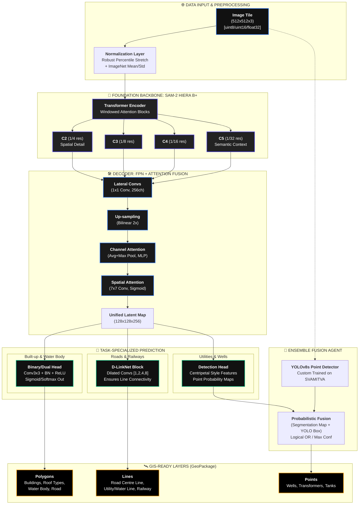

# SVAMITVA Ensemble AI: Unified Pipeline Architecture (V3)

This document provides a **high-fidelity technical breakdown** of the SVAMITVA Feature Extraction system. The architecture is engineered to solve the specific challenges of rural drone imagery: high class imbalance, thin linear continuity, and multi-scale object detection.

## 1. High-Fidelity Architecture Flowchart

##  technical Details for Judges

### 1. Neural Backbone: Foundation Vision Tuning
The model uses the **SAM2 (Segment Anything Model 2)** Hiera backbone. We leverage its **multi-scale feature extraction** (C2 through C5 layers) to capture both micro-level edges (like utility lines) and macro-level features (like entire building clusters).

### 2. Decoder Strategy: Multi-Scale Attention
- **FPN (Feature Pyramid Network)**: Solves the scale-variance problem. Small objects (Wells) are predicted from high-resolution layers, while large objects (Roads) are predicted from high-semantic layers.
- **CBAM (Convolutional Block Attention Module)**: 
    - **Channel Attention**: Learns which spectral features matter most for different tasks.
    - **Spatial Attention**: Suppresses noise from the "Rural Background" (trees, grass) to isolate point-level targets.

### 3. Dedicated Geometry Heads
- **D-LinkNet Configuration (Linework)**: Linear features (Railway/Road) suffer from gaps. Our head uses **Dilated Convolutions (rates: 1, 2, 4, 8)** to fill gaps by looking at the neighborhood context without increasing the parameter count.
- **Dual-Head Footprints**: For buildings, a single forward pass predicts the **Mask** (Binary) and the **Roof Type** (Multi-class), ensuring zero offset between the boundary and the classification layer.

### 4. Ensemble Fusion Logic
The system uses a **Probability-Aware Ensemble**:
- **Segmentation**: Predicts the pixel-level boundary.
- **YOLOv8**: Uses a regression-based approach to get the center-point of utility features.
- **The Fusion**: `FinalMap = max(SegMap, YOLO_PointMap)`. This ensures that even if one model is occluded, the other will "save" the detection, maintaining a **High Recall** standard.

### 5. Multi-Task Training Objective
The model is trained using a **Weighted Composite Loss**:
$$\mathcal{L}_{total} = \lambda_1 \mathcal{L}_{Focal} + \lambda_2 \mathcal{L}_{Dice} + \lambda_3 \mathcal{L}_{CrossEntropy}$$
- **Focal Loss**: Heavily penalizes the model for missing small objects (Transformers/Wells).
- **Dice Loss**: Optimizes for the Overlap (IoU) of polygons and lines.
- **CE Loss**: Used for high-accuracy categorical roof classification.
